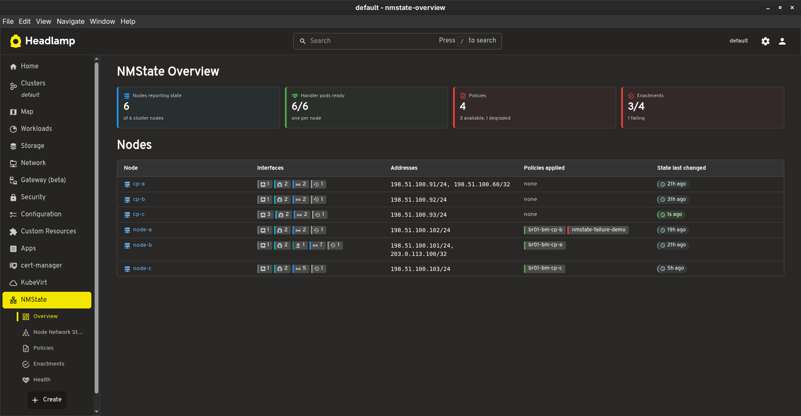
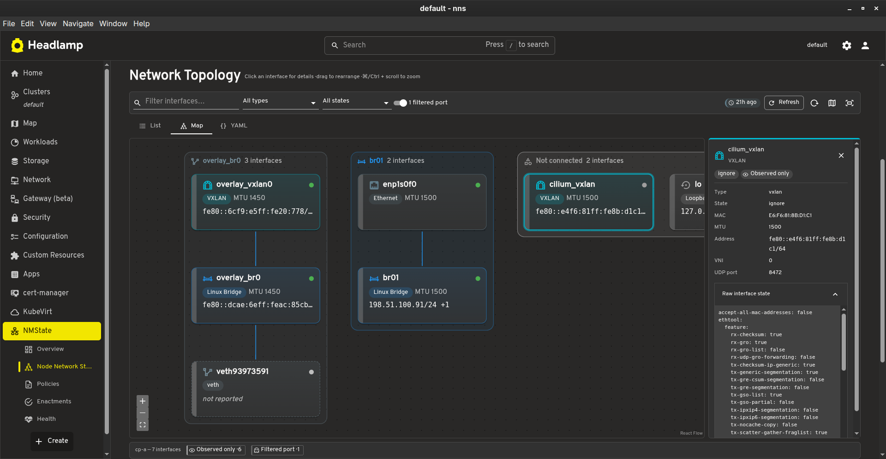
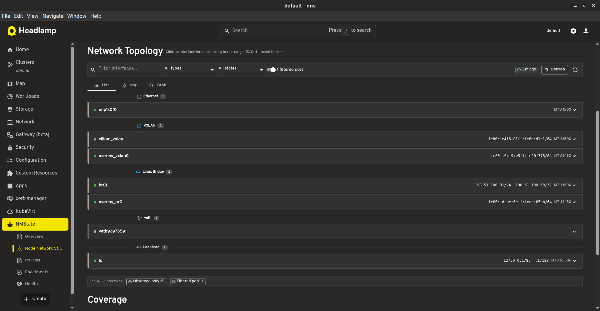
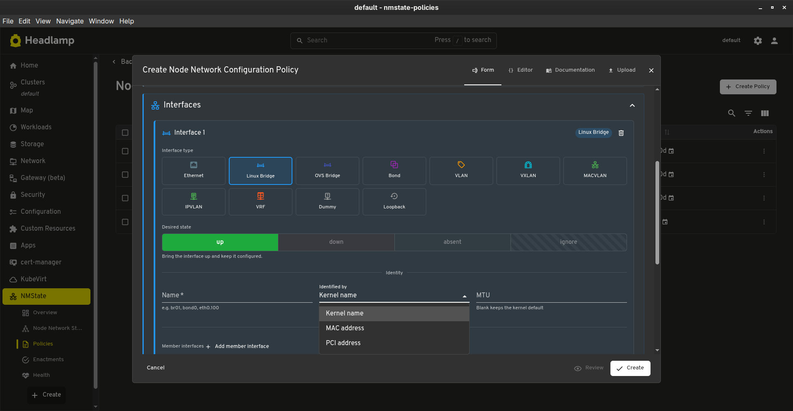
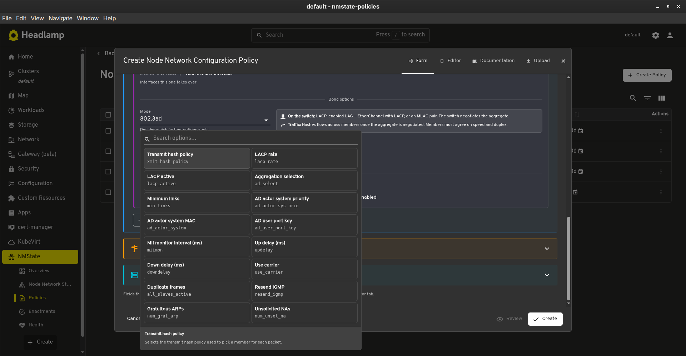
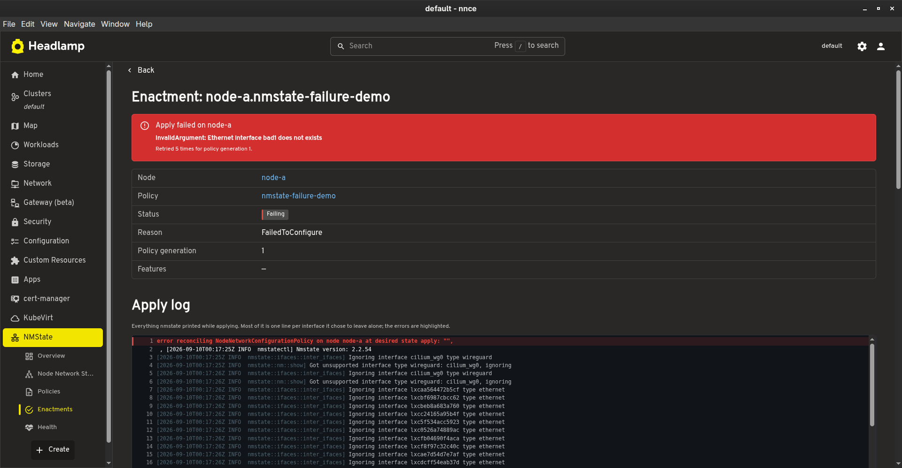
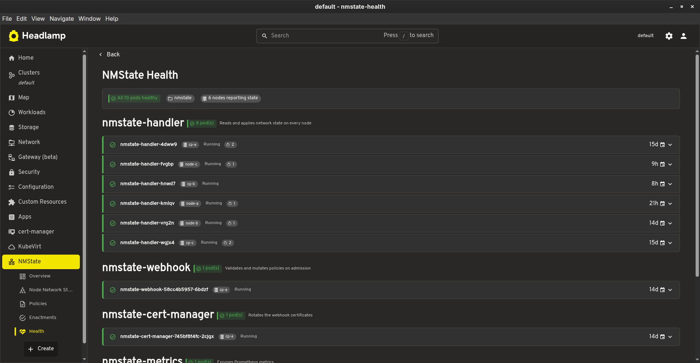

# Headlamp NMState Plugin

[](https://github.com/naval-group/headlamp-nmstate/actions/workflows/build.yml)
[](https://github.com/naval-group/headlamp-nmstate/actions/workflows/codeql.yml)
[](https://scorecard.dev/viewer/?uri=github.com/naval-group/headlamp-nmstate)
[](https://artifacthub.io/packages/headlamp/headlamp-nmstate/headlamp_nmstate)
[](https://github.com/naval-group/headlamp-nmstate/pkgs/container/headlamp-nmstate)
[](https://github.com/naval-group/headlamp-nmstate/releases/latest)
[](https://github.com/naval-group/headlamp-nmstate/blob/main/LICENSE)
[](https://headlamp.dev)
[](https://github.com/naval-group/headlamp-nmstate/stargazers)

A [Headlamp](https://headlamp.dev) plugin for [kubernetes-nmstate](https://nmstate.io/kubernetes-nmstate/):
see what the network on each node actually looks like, declare what it should look like, and find out
why an apply failed without reading a YAML dump.

> **Disclaimer:** This is an independent community plugin. It is not maintained by, affiliated with,
> or endorsed by the [nmstate](https://nmstate.io) project. For nmstate issues, please use the
> [kubernetes-nmstate issue tracker](https://github.com/nmstate/kubernetes-nmstate/issues).

## Features

- **Network topology** — Each node's interfaces drawn as a diagram oriented by role: the physical network at the top, the pods at the bottom, so a stack reads the way traffic flows through it. Every connected stack gets its own frame, side by side, and a bridge's pod ports fold into one node when there are more than a handful
- **List, map and YAML** — The same node from three angles, sharing one set of filters: tick boxes for interface type and state, a name search, and a provenance filter
- **Managed versus observed** — Enactments supply each interface's provenance, so the map tells an interface a policy owns from one merely observed, and links a managed interface straight to the policy declaring it
- **Failures in the open** — The error nmstate raised is lifted out of its apply log and shown on its own; the full log is rendered as a log, with the errors coloured, rather than as a wall of text
- **Honest coverage** — A NodeNetworkState reports less than the kernel has, and the plugin says which parts and why instead of implying completeness
- **Policy authoring** — Eleven interface types with the fields in the same place whatever the type, matching by MAC or PCI address as well as kernel name, capture templates, and a Monaco editor behind the form so unmodelled fields survive a round trip
- **Bond options that fit the mode** — Added from a catalogue carrying nmstate's own description, its documented range, and which modes accept it; each mode states what it needs of the switch and what it does to traffic
- **Deletion that explains itself** — Deleting a policy names the interfaces it will leave configured on the nodes, since nmstate only removes what is set to `absent`
- **Refresh that means something** — Asks the handler to re-read a node, and says so when the node has not changed rather than looking like it did nothing
- **Health** — Every kubernetes-nmstate pod grouped by component, with recent events one click away; a pod that is running but restarting reports as degraded

## Screenshots

### Overview

Nodes reporting state against cluster nodes, handler pods ready against expected, policies by status and enactments applied against total, over a per-node table linking each node to the policies applied to it.



### Network Topology

Each connected stack framed on its own, ordered by role: the uplink above its bridge, the pod-facing ends below. Pod ports fold into a single node that expands on click, and the frames sit side by side so links never cross between unrelated stacks.



### Interface List

The same interfaces read as text, grouped by type along the path a packet takes — physical links, then what is layered on them, then the bridges those feed, then the pod-facing ends. Each row expands to its facts and its raw reported state.



### Creating a Policy

Every interface type puts the same field in the same place. The desired state sits under the type as a single control, because it decides whether the policy creates, leaves alone or deletes.



### Bond Options

Added one at a time from a catalogue that only offers what the chosen mode accepts. The panel under the grid explains whichever option the pointer is on, and the mode itself states what it needs of the switch and what it does to traffic.



### When an Apply Fails

nmstate returns its whole apply log, most of which is one line per interface it left alone. The error is lifted out and shown first; the log stays beneath it, with the errors coloured.



### Health

Every kubernetes-nmstate pod grouped by component, the handler DaemonSet first, with each pod's recent events one click away.



## Prerequisites

- Kubernetes cluster with [kubernetes-nmstate](https://nmstate.io/kubernetes-nmstate/user-guide/deployment)
  installed, and an `NMState` custom resource created so the handler runs on each node
- Headlamp >= 0.24.0

The plugin reads the `nmstate.io` custom resources. Its sidebar hides itself when those CRDs are
absent, and stays visible when it cannot tell — an unreadable API should not silently remove a
feature that may well be installed.

## Installation

### Option 1: Desktop App (Plugin Mode)

For users running the Headlamp desktop application (Linux, macOS, Windows).

#### From Release Artifact

1. Download the latest `headlamp-nmstate-*.tar.gz` from the [Releases](https://github.com/naval-group/headlamp-nmstate/releases) page

2. Extract to your Headlamp plugins directory (the archive creates the `nmstate/` folder automatically):

   **Linux (native)**

   ```bash
   tar -xzf headlamp-nmstate-*.tar.gz -C ~/.config/Headlamp/plugins/
   ```

   **Linux (Flatpak)**

   ```bash
   tar -xzf headlamp-nmstate-*.tar.gz -C ~/.var/app/io.kinvolk.Headlamp/config/Headlamp/plugins/
   ```

   **macOS**

   ```bash
   tar -xzf headlamp-nmstate-*.tar.gz -C ~/Library/Application\ Support/Headlamp/plugins/
   ```

   **Windows (PowerShell)**

   ```powershell
   tar -xzf headlamp-nmstate-*.tar.gz -C "$env:APPDATA\Headlamp\Config\plugins\"
   ```

3. Restart (or reload) Headlamp

#### From Source

```bash
git clone https://github.com/naval-group/headlamp-nmstate.git
cd headlamp-nmstate
npm install
npm run build
```

Then copy the files to the appropriate plugins directory:

```bash
mkdir -p ~/.var/app/io.kinvolk.Headlamp/config/Headlamp/plugins/nmstate
cp dist/main.js package.json ~/.var/app/io.kinvolk.Headlamp/config/Headlamp/plugins/nmstate/
```

### Option 2: In-Cluster (Plugin Manager)

**Recommended for in-cluster deployments.** Headlamp's official
[plugin manager](https://headlamp.dev/docs/latest/installation/in-cluster/#plugin-management)
runs a sidecar that installs this plugin straight from ArtifactHub, verifies its
checksum, and keeps the artifact cached — no custom image or init container to
build and maintain. With `config.watchPlugins` enabled it also picks up new
versions without recreating the Pod.

#### Using Helm

Enable `pluginsManager` in the
[official Helm chart](https://headlamp.dev/docs/latest/installation/in-cluster/)
and point it at this plugin's ArtifactHub package:

```yaml
# values.yaml
pluginsManager:
  enabled: true
  configContent: |
    plugins:
      - name: headlamp_nmstate
        source: https://artifacthub.io/packages/headlamp/headlamp-nmstate/headlamp_nmstate
        version: 0.3.1
    installOptions:
      parallel: true
      maxConcurrent: 3

# Optional: let the main container hot-reload plugins the manager updates,
# without recreating the Pod.
config:
  watchPlugins: true
```

```bash
helm upgrade --install headlamp headlamp/headlamp -f values.yaml
```

Alternatively, keep the plugin list in a standalone [`plugin.yml`](examples/plugin.yml)
and pass it inline:

```bash
helm upgrade --install headlamp headlamp/headlamp \
  --set pluginsManager.enabled=true \
  --set pluginsManager.configContent="$(cat examples/plugin.yml)"
```

Under the hood the sidecar runs `@headlamp-k8s/pluginctl install`, which resolves
the release tarball from the package's ArtifactHub metadata (`archive-url` +
`archive-checksum`), verifies the SHA-256, and extracts it into Headlamp's plugins
directory. Requires Headlamp >= 0.24.0. Pin `version:` to a specific release for
reproducible rollouts.

### Option 3: In-Cluster (Container Mode)

For Headlamp deployed as a Kubernetes service. The plugin is served as an init container that copies the built plugin into a shared volume.

#### Using Helm

If you deploy Headlamp with the [official Helm chart](https://headlamp.dev/docs/latest/installation/in-cluster/), add the plugin as an init container:

```yaml
# values.yaml
initContainers:
  - name: headlamp-nmstate
    image: ghcr.io/naval-group/headlamp-nmstate:latest
    command: ['/bin/sh', '-c']
    args:
      - 'cp -r /plugins/nmstate /headlamp-plugins/'
    volumeMounts:
      - name: headlamp-plugins
        mountPath: /headlamp-plugins

volumeMounts:
  - name: headlamp-plugins
    mountPath: /headlamp/plugins

volumes:
  - name: headlamp-plugins
    emptyDir: {}
```

Then install/upgrade:

```bash
helm repo add headlamp https://headlamp-k8s.github.io/headlamp/
helm upgrade --install headlamp headlamp/headlamp -f values.yaml
```

#### Using kubectl

```yaml
apiVersion: apps/v1
kind: Deployment
metadata:
  name: headlamp
spec:
  template:
    spec:
      initContainers:
        - name: headlamp-nmstate
          image: ghcr.io/naval-group/headlamp-nmstate:latest
          command: ['/bin/sh', '-c']
          args:
            - 'cp -r /plugins/nmstate /headlamp-plugins/'
          volumeMounts:
            - name: headlamp-plugins
              mountPath: /headlamp-plugins
      containers:
        - name: headlamp
          image: ghcr.io/headlamp-k8s/headlamp:latest
          args:
            - '-plugins-dir=/headlamp/plugins'
          volumeMounts:
            - name: headlamp-plugins
              mountPath: /headlamp/plugins
      volumes:
        - name: headlamp-plugins
          emptyDir: {}
```

### Option 4: In-Cluster (Image Volume)

For Kubernetes clusters running Headlamp where you'd rather mount the plugin via the
[Kubernetes image volume source](https://kubernetes.io/docs/concepts/storage/volumes/#image)
instead of using an init container. Requires Kubernetes >= 1.35 (on by default) or 1.34
with the `ImageVolume` feature gate enabled, and a container runtime with image volume
support (containerd >= 2.1, CRI-O >= 1.31).

The plugin is published as a file-only image (`FROM scratch`) at
`ghcr.io/naval-group/headlamp-nmstate-oci`. `main.js` and `package.json` sit at the
image root, so mounting the volume directly under the Headlamp plugins-dir gives you a
ready-to-load plugin sub-directory.

#### Using Helm

```yaml
# values.yaml
volumes:
  - name: nmstate-plugin
    image:
      reference: ghcr.io/naval-group/headlamp-nmstate-oci:latest
      pullPolicy: IfNotPresent

volumeMounts:
  - name: nmstate-plugin
    mountPath: /headlamp/plugins/nmstate
    readOnly: true
```

#### Using kubectl

```yaml
apiVersion: apps/v1
kind: Deployment
metadata:
  name: headlamp
spec:
  template:
    spec:
      containers:
        - name: headlamp
          image: ghcr.io/headlamp-k8s/headlamp:latest
          args:
            - '-plugins-dir=/headlamp/plugins'
          volumeMounts:
            - name: nmstate-plugin
              mountPath: /headlamp/plugins/nmstate
              readOnly: true
      volumes:
        - name: nmstate-plugin
          image:
            reference: ghcr.io/naval-group/headlamp-nmstate-oci:latest
            pullPolicy: IfNotPresent
```

Compared to the init-container approach, this skips an extra Pod startup step and lets
the kubelet's image cache serve the plugin directly. Pin a specific version tag (e.g.
`:0.3.1`) in production rather than `:latest`.

## Development

```bash
# Install dependencies
npm install

# Start development server (with hot reload)
npm run start

# Build for production
npm run build

# Run tests
npm run test

# Lint
npm run lint

# Type check
npm run tsc
```

## License

Apache-2.0
